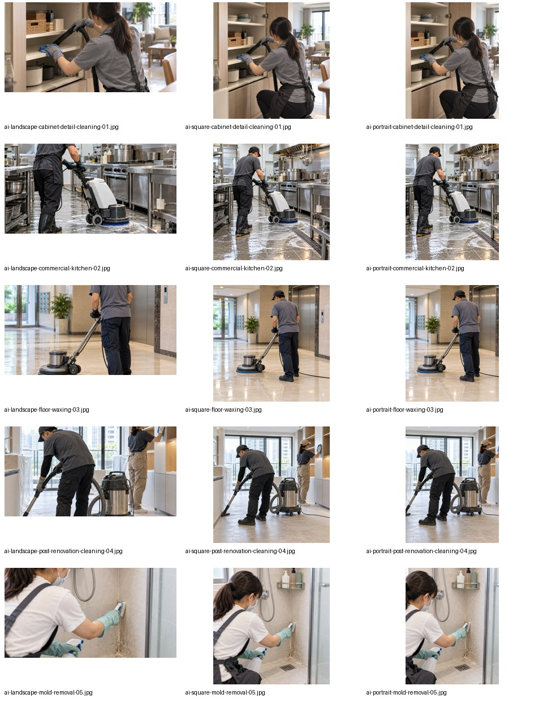
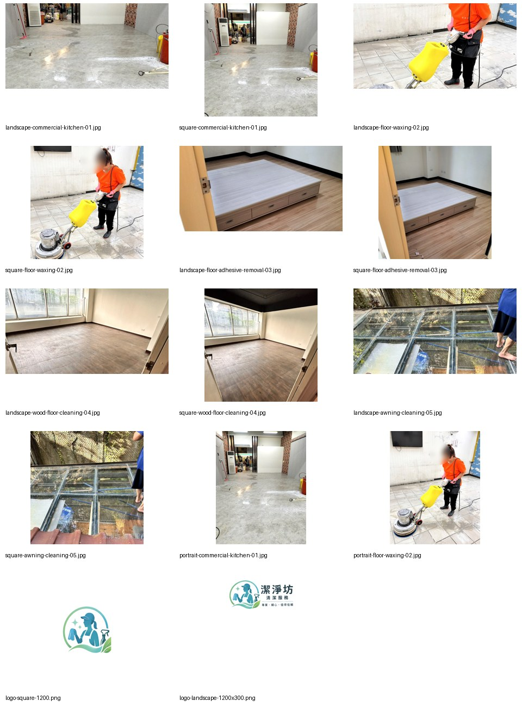

# 潔淨坊 Google Ads 素材下載

兩批素材已整理成 ZIP，可在不同電腦直接下載、解壓縮，不需要安裝製圖軟體。

## 一鍵下載

| 素材包 | 內容 | 下載 |
|---|---|---|
| AI 服務情境素材（2026-10-05） | 5 個情境 × 橫式／方形／直式，共 15 張 JPEG；另附生成母圖、來源清單、總覽與裁切腳本 | [下載 AI 素材 ZIP](https://github.com/Campcool/0983531549/raw/refs/heads/main/ads/google-ads/downloads/google-ads-ai-generated-package.zip) |
| 網站實拍素材＋Logo（2026-10-03） | 5 張橫式、5 張方形、2 張直式、2 張 Logo；另附來源清單、總覽與處理腳本 | [下載實拍素材 ZIP](https://github.com/Campcool/0983531549/raw/refs/heads/main/ads/google-ads/downloads/google-ads-package.zip) |

也可以打開 `downloads/` 裡的 ZIP 檔案頁，再按 **Download raw file** 下載。

## 預覽

### AI 服務情境素材

### 網站實拍素材與原始 Logo

## 檔案用途

- `images/`：第一批網站實拍 JPEG、兩種原始 Logo PNG、`manifest.csv`。
- `images-ai-generated/`：第二批 AI 情境 JPEG、`manifest-ai-generated.csv`。
- `generated-masters/`：AI 生成母圖，保留供重新裁切。
- `downloads/`：兩份完整交付 ZIP。
- `build-ad-images.py`、`build-generated-ad-images.py`：可重跑的 Pillow 影像處理腳本。

JPEG 尺寸為橫式 1200×628、方形 1200×1200、直式 960×1200。搜尋廣告圖片優先使用橫式與方形；直式供支援該比例的廣告版位使用。

`contact-sheet*.jpg` 是檢查用拼貼總覽，**不可作為廣告圖片上傳**。Logo 是獨立標誌素材，請上傳到支援的標誌欄位。

AI 情境圖並非真實案場或真實員工，不要搭配「本案實績」「實際完工照」等敘述。兩批素材以資料夾及 `ai-` 前綴辨別，manifest 記錄來源；生成母圖另存供重新裁切。素材尚未取得 Google Ads 最終審核結果。

## 封裝紀錄

ZIP 是本次交付檔的固定快照；其中的 `AI-README.md` 是封裝當時的交接文件。之後的 repo 更新以根目錄最新 `AI-README.md` 為準。
